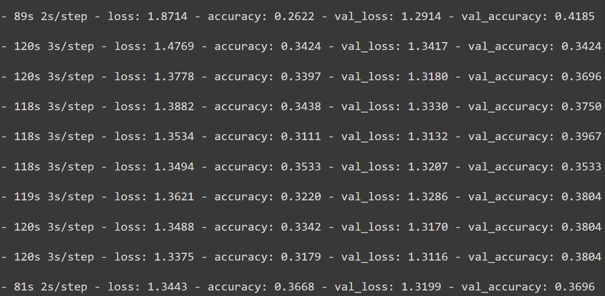

# Wykrywanie anomalii w analizie dźwięków układu oddechowego

## Cel projektu
Celem projektu jest utworzenie modelu uczenia maszynowego, który byłby odpowiedzialny za analizowanie sekwencji danych dźwiękowych, pochodzących z nagrań układu oddechowego w celu wykrycia anormalnych układów częstotliwości, które wskazywałyby na nienaturalny proces oddychania.

## Członkowie grupy i wstępny podział obowiązków
- **Łukasz Zawadzki**  
  Przygotowanie i preprocessing danych treningowych

- **Damian Moskała**  
  Implementacja algorytmów uczenia modelu

- **Witold Nowogórski**  
  Rozwinięcie niskopoziomowego składu bloków modelu

- **Jakub Kubicki**  
  Specyfikacja portów dla meta-danych warunkujących (meta-dane pobrane ze zbioru danych, niebędące bezpośrednim nagraniem dźwiękowym)

- **Wiktor Prosowicz**  
  Opracowanie wysokopoziomowej struktury modelu

## Źródła danych
Prace wraz ze zbiorami danych, na których się opieramy:
- [Coswara-Data](https://github.com/iiscleap/Coswara-Data)
- [Artykuł Coswara-Data](https://arxiv.org/abs/2005.10548)
- [RespireNet](https://github.com/microsoft/RespireNet)
- [Artykuł RespireNet](https://arxiv.org/abs/2011.00196)

## Harmonogram prac

### 16.04
- Przygotowanie danych i ustalenie portów wejściowych modelu
- Opracowanie wysokopoziomowej struktury modelu

### 21.05
- Wstępna implementacja modelu
- Testy na dostępnym zbiorze danych

### 4.06
- Rozwinięcie modelu
- Poprawa jakości kodu i błędów modelu

### 18.06
- Użytkowa wersja systemu wraz z aplikacją i walidacją danych wejściowych

# Model description
## Authors:
- Witold Nowogórski
- Łukasz Zawadzki
- Jakub Kubicki
- Damian Moskała
- Wiktor Prosowicz

## Work overview

### Data augmentation

Due to the small size of the dataset chosen for this project and due to the fact that a DNN architecture has been proposed, there is a need for additional data samples. To address this problem a set of audio data augmentation procedures shall be applied.

#### Noise addition

It's purpose is to both simulate the real-world conditions and provide slightly different data samples.

#### Tempo modification

It reduces the influence of the disproportion between the encountered tempo range and the number of samples on the model's performance.

#### Spectral clipping

Consists mostly on low-pass filtering. It's role is to cut out background noises. It allows to control the amount of external noise added to a sample. 

#### Time domain clipping/padding

Adopted in order to unify the samples regarding their duration.

- Smart padding - it is a modification of the standard zero-padding technique. It involves repetition of breath cycles across the sample's time domain. 
- Concatenation-based augmentation - filling the empty space with fragments sampled from all classes.

### Feature Extraction

The input port of the model consists of Mel Frequency Cepstral Coefficients. This form of audio-data presentation allows to capture speech-related features of sound. MFCCs are obtained via cosine-transform of log-spectrogram. The resulting samples have the form of a matrix with axes representing time, mel filterbanks respectively.

### Model training

We propose a deep neural architecture consisting mainly of convolutional layers with skip connections. 

### Model evaluation

The model's output is evaluated via set of scores. Those check whether the model accurately predicts the expected multi-class result. Due to the skewed distribution of dataset samples among various classes and recording appliances it is crucial to evaluate the model with respect to the classes to which a specific sample belongs.

# Milestone 21.05

## Dataset
[source](https://bhichallenge.med.auth.gr/ICBHI_2017_Challenge)

The ICBHI 2017 Challenge Respiratory Sound Database is a collection of 5.5 hours of audio recordings from 126 subjects, annotated by respiratory specialists to identify crackles, wheezes, or normal breath sounds. The recordings come from various chest locations and were captured using different stethoscopes and microphones. Additional information such as diagnoses (COPD, LRTI, URTI) and demographics (age, sex, BMI) is available for each subject. This freely available resource is valuable for training machine learning models to recognize respiratory anomalies.

## Models
### VGG16

The VGG-16 neural network is a convolutional neural network (CNN) known for its simplicity and effectiveness achieved through a stacked architecture of convolutional and pooling layers that extract increasingly complex features from images. Here's the breakdown:

- Convolutional Layers: These layers apply filters to the image, identifying patterns and edges. VGG-16 uses small filters (3x3) stacked together, increasing in number as the network progresses (64, 128, 256, 512).
- Pooling Layers: These layers reduce the image size while preserving important features. VGG-16 uses max pooling, which takes the maximum value from a small grid of pixels.
- Fully Connected Layers: These layers connect all neurons from the previous layer, allowing for complex classifications. VGG-16 has three fully-connected layers with ReLU activation, leading to a final output layer with probabilities for 1000 classes (Softmax activation).

Despite its relative simplicity compared to more recent models, VGG-16 remains a popular choice for its strong performance and ease of use.

### UNet
U-Net is a widely used deep learning architecture that was first introduced in the [U-Net: Convolutional Networks for Biomedical Image Segmentation](https://arxiv.org/abs/1505.04597v1) paper. The primary purpose of this architecture was to address the challenge of limited annotated data in the medical field thus this network was designed to effectively leverage a smaller amount of data while maintaining speed and accuracy. It consists of a two paths:
- Contracting Path (Encoder): This initial part resembles a standard convolutional neural network. It captures high-level features through repeated applications of 3x3 convolutions, ReLU activations, and 2x2 max pooling operations. Notably, the number of feature channels doubles with each downsampling step.
- Expansive Path (Decoder): This path expands the captured features back to the original image resolution. Each step involves upsampling the feature map, halving the number of channels with a 2x2 convolution, and then concatenating it with cropped features from the contracting path at the same level. Finally, two 3x3 convolutions with ReLU activations are applied.
- Output Layer: A final 1x1 convolution transforms the high-level features into predictions for the desired number of classes.

### ResNet

ResNet50's strength is its deep convolutional architecture with residual connections. These connections allow it to learn much deeper than previous models by adding the original input to later layers, bypassing vanishing gradients. The network relies on identity and convolutional blocks for processing, with convolutions extracting features and identity blocks preserving information. Batch normalization and ReLU activations further enhance training and decision-making.

## Training

### Resnet

